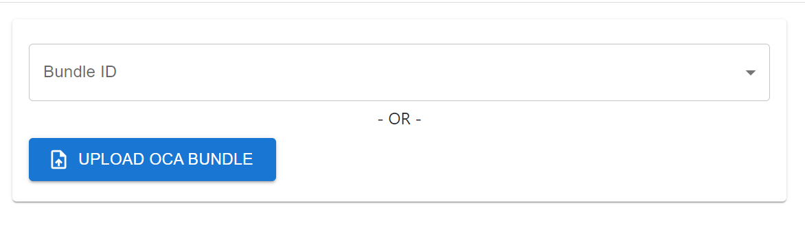

# Aries OCA Bundles

This GitHub repository is for hosting published Overlays Capture Architecture
(OCA) Bundles to be used by Hyperledger Aries agents (issuers, holders and
verifiers). The repository includes a [lightweight governance](GOVERNANCE.md)
process for ensuring those contributing to the repository are the "authority"
over the OCA Bundle they are submitting/updating, and that what they are
submitting is, in fact, an OCA Bundle for a published AnonCreds Schema and/or
Credential Definition.

The OCA Bundles should follow the rules for [OCA for Aries]() OCA Bundles,
including the [OCA for Aries Style Guide](). Each OCA Bundle must be accompanied
by some metadata about the credential, such as on what ledger the credential
schema and definition (CredDef) reside, and may be accompanied by the full OCA
Source data--Excel and JSON files.  We have some tools in the repo for
converting OCA Source to the Bundle to make it easier for contributors.

Currently, the repository assumes that the OCA Bundles are for [Hyperledger
AnonCreds Verifiable Credentials](https://hyperledger.org/use/anoncreds). We
expect that other formats, such as W3C Verifiable Credentials Data Model
Standard JSON-LD credentials will eventually also be supported.

## Previewing And Designing OCA Bundles

When it comes to creating an OCA Bundle previewing the branding can be
done with the [OCA
Explorer](https://bcgov.github.io/aries-oca-bundles/)

### What is OCA Explorer

Overlays Capture Architecture (OCA) allows issuers to control the look
of a credentials in a users wallet. In addition, OCA makes supporting
multiple languages such as French and English easy.

### Using OCA Explorer

To design and preview an OCA Bundle, head over to the [OCA
Explorer](https://bcgov.github.io/aries-oca-bundles/) and select an
and either choose from an existing bundle in the repository or upload
a new one.



To view a preview of the selected or uploaded OCA Bundle, simply
select it and the preview will appear, allowing you to choose from a
variety of available languages using radio buttons.

The remaining fields are derived from the
`aries/overlays/branding/1.0` schema, which can be customized
according to your preferences. You can easily fill in these fields and
download the branding overlay by clicking on the `DOWNLOAD BRANDING
OVERLAY` button.

Take a look at the screenshot below for an idea of what the branding
customization interface looks like:


Don't hesitate to experiment and create an OCA Bundle that best suits your needs!

## Locations of OCA Bundles

OCA Bundles in this repository are found in the [OCABundles](./OCABundles/)
folder in this repository. The folder structure within `OCABundles` is as follows
with OCABundle JSON files in the `<Credential>` and `<Schema>` folders.

```
OCABundles
 ┣ credentials
 ┃ ┣ <Issuer>
 ┃ ┃ ┣ <Credential>
 ┃ ┃ ┗ <Credential>
 ┃ ┣ <Issuer>
 ┃ ┃ ┣ <Credential>
 ┃ ┃ ┗ <Credential>
 ┗ schema
 ┃ ┣ <Publisher>
 ┃ ┃ ┣ <Schema>
 ┃ ┃ ┗ <Schema>
 ┃ ┗ <Publisher>
 ┃ ┃ ┣ <Schema>
 ┃ ┃ ┗ <Schema>
 ```

## Contributing an OCA Bundle

To contribute an OCA Bundle, create a pull request that adds the necessary files
for the Aries for OCA:

* In the OCABundles `schema` or `credentials` folder, if needed, create a new
`<Issuer>` or `<Publisher>`. Those folders are for organizing the credentials
and the folder naming is up to the submitter.
* Within that folder, create another folder named for the schema or credential
  definition being added.
* Within that folder, add the following files, as appropriate:
    * README.md: **MUST** be present and **MUST** contain the information outlined
      below in the [README File Content](#readme-file-content) section of this document.
    * OCABundle.json: **MUST** be present and **MUST** contain the OCA Bundle
      for the schema or credential definition.
    * \<OCASourceExcel>.xlsx: (optional) An Excel OCA Source file for the OCA Bundle.
    * branding.json: (optional) A JSON file containing the source content for
      the OCA for Aries Branding overlay.
    * testdata.csv: (optional) A CSV file containing one or more sample data
      records.
    * Other files: (optional) Other files related to the OCA Bundle, such as the
    images used in the branding.json file.

The pull request will be reviewed according to the [lightweight governance](GOVERNANCE.md)
process and merged (or not) into the repository.

### README File Content

The README.md file for the OCA Bundle **MUST** be present and **MUST** include
begin with the information shown and described below. The formatting requirements
are in place because the file is processed by a script that generates a list
of all of the identifiers (`schemaId`s and `credDefId`s) and the OCA Bundles
to which they are associated with.

```text
# <TITLE>

<DESCRIPTION>

- Publishing Organization: <ORGANIZATION>
- Primary Contact Email Address: <CONTACT EMAIL ADDRESS>

## Identifiers

| Identifier                                 | Location  | URL         |
| ------------------------------------------ | --------- | ----------- |
| <SCHEMA ID or CRED DEF ID>                 | <LEDGER>  | <URL>       |

## Authorization

The following are the GitHub IDs of those authorized to make substantive updates to the OCA Bundle.

| OCA Bundle Contributors | GitHub ID   | Email Address            |
| ----------------------- | ----------- | ------------------------ |
| <NAME>                  | <GITHUB ID> | <EMAIL ADDRESS>          |

```

Everything not in `<>`s must be exactly as specified above (with one
exception--see below). Everything in `<>`s **MUST** be populated as described
below.

The two markdown tables **MAY** have multiple lines. Multiple lines in the
`Identifiers` table indicates that the same OCA Bundle is used for each of the
objects identified in the first column. Multiple lines in the `Authorization`
table is recommended so that multiple members of the submitters team may update
the OCA Bundle.

- `<TITLE>` **MUST** be the name of the credential type. No other line in the
  file can have a single `#` prefix.
- `<DESCRIPTION>` is extracted for display by tools for processing this
repository (such as the [OCA Explorer]) and should describe the type of
credential to which the OCA Bundle applies.
- `<ORGANIZATION>` is extracted for display by tools for processing this
repository (such as the [OCA Explorer]) and is the name of the organization
that submitted the OCA Bundle.
- `<CONTACT EMAIL ADDRESS>` is an email address for the primary contact
for the OCA Bundle. The address may for a person, or better, a group
contact withing the `<ORGANIZATION>`.
- `<SCHEMA ID or CRED DEF ID>` are identifiers for objects to which the
OCA Bundles applies. There can be multiple lines in the table, each with
a different identifier.
- `<LEDGER>` is optional. It identifies the ledger on which the object
identified by the object resides. It should be in the form
<network>[:<instance>] as defined in the [did-indy specification for
`namespace`](https://hyperledger.github.io/indy-did-method/#indy-did-method-identifiers)
-- e.g., `candy:dev` or `sovrin`. The value is useful when the `<SCHEMA ID or
CRED DEF ID>` is unqualified (such as with legacy Indy identifiers) such that
the precise location of the object is not known.
- `<URL>` is optional and is a plain (non-Markdown) link to a ledger browser
  instance of the object, such as to a transaction on
  [https://indyscan.io](https://indyscan.io) or
  [https://candyscan.idlab.org/](https://candyscan.idlab.org/)
- `<NAME>' is the name of a person authorized to update the OCA Bundle and
related data. There may be multiple rows in the markdown table to name multiple
people.
- `<GITHUB ID>` is the GitHub ID of the named person.
- `<EMAIL ADDRESS>` is the email address of the named person

[OCA Explorer]: https://bcgov.github.io/aries-oca-bundles/

The `<CONTACT EMAIL ADDRESS>` and the Authorization table are to ensure that
once the OCA Bundle is submitted, there are contacts available to answer
questions about, and to submit updates to, the OCA Bundle.

The contents of the `Authorization` section (following the `## Authorization` line) may be replaced 
with the following to avoid repeating the same contents in every OCA Bundle `README.md` file:

`The Authorization table for this OCA Bundle is in [this file](<path-to-another-OCABundle-folder/README.md).`

## Agent Processing

The following are the steps for processing the OCA Bundle by an Aries Holder or Verifier.

An Aries holder (wallet) or verifier agent **MUST** be pre-configured with the
URL (\<URL> in the following) for accessing raw files in the main branch of the
`OCABundles` folder in this repository, e.g.
`https://raw.githubusercontent.com/bcgov/aries-oca-bundles/main`.

On receipt of an AnonCreds Credential Definition ID (credDefid), the Aries agent **SHOULD** do the following:

- Load the JSON file `<URL>/ocabundles.json`.
  - This may be done at Aries wallet/agent initialization time and the contents
    cached. The wallet/agent may reload the file from time to time to get
    updates to the contents.
- Scan the list of identifiers for the credDefId in the loaded JSON data structure.
  - If found, use the corresponding `path` item value to load the OCA Bundle for the credential at (`<URL>/<path>`).
- Scan the list of identifiers for the schemaId referenced in the Credential Definition in the loaded JSON data structure.
  - If found, use the corresponding `path` item value to load the OCA Bundle for the credential at (`<URL>/<path>`).
- If not found, proceed without an OCA Bundle for the credential.

The wallet/agent may want to cache a loaded OCA Bundle.

### Processing Notes

* A given Aries agent **MAY** want to pre-load OCA Bundles for Schemas or
Credential Definitions all of the identifiers in the `ocabundles.json` file.
From time-to-time, such agents may want to reload the Bundles in case they have
been updated in the repository.

## Creating the OCA Bundle JSON

See the instructions for creating an OCA Bundle JSON file from Excel and JSON source
in the file [OCABundleCreation.md](OCABundleCreation.md) in the root of this repository.
