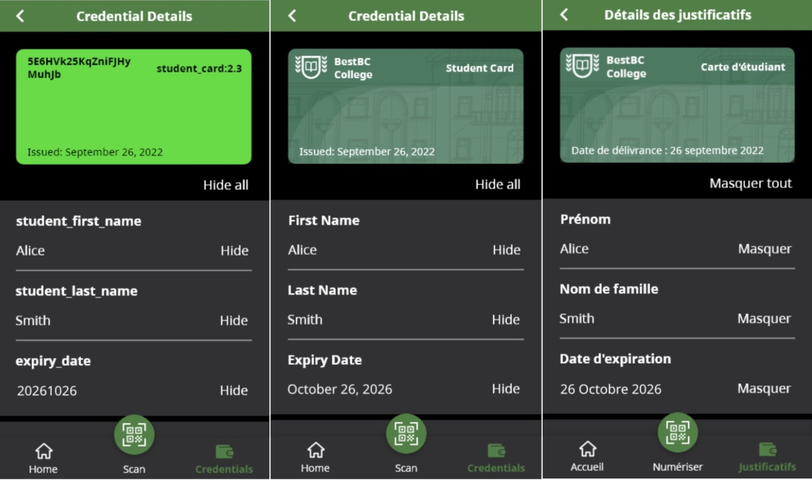

# OCA Bundle Creation

An OCA (Overlays Capture Architecture) Bundle allows verifiable credential issuers to customize the display of their credential, managing translations, branding, attribute rendering, etc. The image belows shows an example of a verifiable credential displayed without an OCA Bundle, and the same credential with an OCA Bundle, first in English and then in French. OCA Bundles are used by mobile wallets, such as those built on the [OpenWallet Foundation]'s [Bifold Wallet].


[OpenWallet Foundation]: https://openwallet.foundation/
[Bifold Wallet]: https://github.com/openwallet-foundation/bifold-wallet

Creating an OCA Bundle from scratch consists of a number of steps. Because some of these steps are quite technical, we've separated the instructions into two parts:

- Creating the information needed to create the OCA Bundle for submitting a GitHub Issue in the [Aries OCA Bundles] repository to have the OCA Bundle created. This is usually handled by a designer collaborating with translation experts.
- The (quite technical) steps for submitting a Pull Request (PR) to actually create and publish the OCA Bundle. Since the process is quite technical, feel free to stop at the "Create Issue" step, and we'll take it from there -- getting an approval from you that we didn't mess anything up in creating the PR. This is usually done by the maintainers of the [Aries OCA Bundles] repo, or a developer on the Issuer's side.

If you are not a developer with GitHub, Rust compiling, JQ, and bash skills, you only do the first part, as described in this document. If you have those skills and don't want to exercise them (we get it!), you can also stop with this document. If you really, really want to go through the create-and-PR process, have it at -- those instructions are in the [Create the OCA Bundle PR] document.

[Create the OCA Bundle PR]: ./OCABundleCreatePR.md

So, to get as far as creating an Issue, here's a summary of what you are going to do:

- Create the OCA Bundle source data using Excel, the OCA Explorer site and a text editor, including identifying the logo, images and other branding data.
- Gather the identifiers (schemaId or credDefId) for the credential to which the bundle applies.
- Determine where in the [Aries OCA Bundles] repository the OCA Bundle should be placed.
- Create a GitHub Issue in the [Aries OCA Bundles] repository, attaching the files about the OCA Bundle.

[Aries OCA Bundles]: https://github.com/bcgov/aries-oca-bundles

We'll cover each steps in the following sections.

## Collect the OCA Bundle Source Data

To get started, you will need to collect some basic information about the credential for which you are building an OCA Bundle. If you are not familiar with how you can control the display of a credential using an OCA Bundle, please take a look at the result of applying OCA Bundles to existing credentials, by going to the [OCA Explorer] tab of this website. There, you can select and review the existing credentials, and see how others have used OCA for their credentials. You should also review the [OCA for Aries Style Guide]. It has the details about what you can control in displaying your credential, and Do's and Don'ts as you create your bundle.

[OCA Explorer]: https://bcgov.github.io/aries-oca-explorer/

Once you have an idea of what you are going to be doing, you need to gather some data:

- The list of attributes and their data types in the credential. That will usually come from the technical team creating the credential issuer software.
- The images that you want to use in displaying your credential -- a logo, background image and a background image slice. Guidelines for, and how the images will be used, are below.
- The colours (or colors) you want to use for the credential -- a primary and secondary, in RGB hex format.

You will use the [OCA Explorer] to experiment with your images and colours as you adjust them to be just right.

!!! note
    In most cases, you only create one OCA Bundle for a credential that your organization Issues, and use it for the Dev, Test and Production sites. Often, a watermark is added to differentiate a "Test" credential from a production one. However, you want to have different OCA Bundles for Dev/Test and Production. If you do, simply create multiple OCA Bundles. If adds management overhead, but that's all. It's up to you.

Let's get started.

[OCA for Aries Style Guide]: https://hyperledger.github.io/aries-rfcs/latest/features/0756-oca-for-aries-style-guide/

## Create the OCA Excel File

Start by downloading [this OCA Excel File] that you will save locally and then populate with details about your credential. You can name the local file whatever you want, or keep the default "OCA.xlsx". Because the Excel file will be put into a Bundle-specific folder in the Aries OCA Bundles repository, it need not have a credential-specific name. Open up the file in Excel and use the instructions on the file to populate the document for your credential. Here is a quick summary of the process:

[this OCA Excel File]: https://github.com/bcgov/aries-oca-bundles/raw/refs/heads/main/docs/OCA.xlsx

- On the "Main" tab, enter a list of the attributes in your credential in the column titled `CB-AN: Attribute Name`.
  - NOTE: The Excel-to-Bundle translation is a bit fragile, so don't change the column titles or orders. If it happens accidentally, it's not a big deal -- it just might mean having to fix the columns.
- Select the data types for each attribute. Follow the guidance for that on the "Documentation" page.
- Once all of the attributes are on the "Main" tab, go to the "en" and "fr" tabs and fill in:
  - The language specific information about the credential itself (name, description, etc.). The name of the value to enter is in the first column (A `OL-MN: Meta [Attribute Name]`) -- you need to fill in values in the second column (B `OL-MV: Meta [Attribute Value]`).
  - Enter the `Label` and `Information` column for each listed credential attribute. The list of credential attributes will have been automatically filled in from "Main". Don't edit them in these tabs -- always update the attribute list in the "Main" tab.
- Adding and/or removing languages.
  - If you want to add more languages, make a copy one of existing language tabs (e.g. "en" or "fr"), rename the new tab to the two-letter code for the added language (e.g. `es` for Spanish), and fill in the data about the credential and attributes.
  - If you don't want either or both of the default "en" and "fr" tabs, simply delete the tab(s) that aren't needed.

That's it. Save the Excel file and you are good to go. Right now, we don't have a good way to test the Excel file before it goes into the [Aries OCA Bundles] repository.  We hope to add that soon.

If you want to update the Excel file after it has been put (merged) into the [Aries OCA Bundles] repository, make sure you download the latest version of the file from the repository before editing, so you don't lose any edits others may have made. Your local copy may not be the latest!

## Generate The Branding JSON File

The second file you need to create is the `branding.json` file. The easiest way to create the file is to use the [OCA Explorer]. Unfortunately, doing that is a bit of a hack, but bear with us. We hope to have a smoother process soon.

The first step is to get the colors, logo, and images right. To do that, we'll use another credential's Bundle, ignore the attribute names and focus on the visual.

To do that:

- Loop:
    - Create/retrieve/update the logo and other images to be used in the OCA Bundle.
        - Make sure in creating/adjusting the images that you use the size guidelines in the [OCA for Aries Style Guide RFC](https://hyperledger.github.io/aries-rfcs/latest/features/0756-oca-for-aries-style-guide/#logo-image-specifications). We don't want massive image files -- they need to be as small (in bytes) as possible. In Summary:
            - Logo: 1:1 aspect ratio, 240x240px
            - Background Image Slice: 1:10 aspect ratio, 120x1200px
            - Background Image: 3:1 aspect ratio, 360x1080px
    - Go to the [OCA Explorer] Tab, and load any existing OCA Bundle.
        - Ignore the attribute names (since they don't match your credential...) -- focus on the colors and images.
    - Use the form (mage below) at the bottom of the page to:
        - Load the latest images.
            - You can either use URLs for the images or upload them into the form.
            - You might upload them while you are iterating, and then use URLs when you are finished.
        - Adjust the colors using the color picker in the form.
        - If you plan on having primary/secondary attributes leave them as is, or remove them.
- Repeat until you have the logo, images and colours *Just Right*.
- If needed, update the values for the images:
    - If you intended to upload the images into the [Aries OCA Bundles] repository, set them to just the file name (e.g., "IssuerLogo.png").
    - If you have a remote URL for the images, insert the URL.
    - If you want the images embedded in the OCA Bundle, upload them using the form.
- Add in the primary and secondary attributes specific to your credential.
- Download the `branding.json` file.

The OCA Explorer Branding form:


As needed, you may edit the resulting `branding.json` file manually in a text editor, or keep using the OCA Explorer method -- create and download.  Here's what the file will look like. Two things to note:

- If you uploaded the images in the OCA Explorer, and left them as is, those fields will be VERY long. That's OK, if that is what you want.
- If you an attribute in the credential that holds the "Issued Date", and/or the "Expiry Date", type in the names of those attributes as value of the respective data elements (`"issued_date_attribute"`, `"expiry_date_attribute"`) below.

```json
{
  "capture_base": "",
  "type": "aries/overlays/branding/1.0",
  "digest": "",
  "logo": "https://raw.githubusercontent.com/bcgov/aries-oca-bundles/main/OCABundles/schema/bcgov-digital-trust/LCRB/selling-it-right-showcase/bc-logo.jpg",
  "background_image_slice": "https://www.responsibleservicebc.gov.bc.ca/files/static/bc_wallet_vc_lcrb_image_slice_sell_right.jpg",
  "background_image": "https://www.responsibleservicebc.gov.bc.ca/files/static/bc_wallet_vc_lcrb_background_image_sell_right.jpg",
  "primary_background_color": "#003366",
  "secondary_background_color": "#fcbc1e",
  "primary_attribute": "given_names",
  "secondary_attribute": "family_name",
  "issued_date_attribute": "",
  "expiry_date_attribute": ""
}
```

## Submit Your OCA Bundle As An Issue

We are now ready to create the first iteration of the OCA Bundle. If you are a Developer familiar with submitting GitHub PRs, editing Markdown, compiling and running Rust programs, and running bash scripts, you can submit the PR yourself -- instructions below. However, if not no problem! Please create an Issue in the GitHub [Aries OCA Bundles] repository using the instructions below, and we'll take it from there. We're happy to do that, and you will be able to approve the PR before it is merged into the repository. Likewise, once the PR is created and merged, we're happy for you to requests tweaks to the OCA Bundle via issues or PRs -- submitting updates to the Excel file, branding file or other information about the OCA Bundle.

Here's how to create the Issue. We'll probably add a GitHub issue template to make this easier.

- Click [here](https://github.com/bcgov/aries-oca-bundles/issues/new/choose) to create a new GitHub Issue in the right repo.
- Call the issue "New OCA Bundle for Credential `<NAME>` from Issuer `<Issuer>`"
- In the description, include:
    - A brief background of the request -- the project, and desired timeline for the OCA Bundle to be available in the Wallet.
    - Propose where the OCA Bundle should go in the existing data structure. Likely that will be determined by the Issuer organization and the credential type.
    - A list of names and email addresses of those that will be authorized to make/approve updates to the Bundle. Include your name and email, please.
    - Attach at least the OCA Excel file and branding.json files.
    - Attach the images that you want put into the OCA Bundle folder. If the images are embedded in the `branding.json` file, or are URLs to remote image files, the images need not be attached.
- If you know the following information, enter it in the description. Alternatively, you might ask a technical resource on your team that has this information to enter it into a comment on the Issue.
    - The `credDefId`s (and/or `schemaID`s) associated with the OCA Bundle. For each:
        - Include the location of the ID (e.g. "CANdy Dev", "CANdy Test", etc.).
        - Include the text of a "watermark", if any, for each Identifier, and in each desired language (e.g., English, French, etc.).

That's it.  We'll take it from there, using the Issue comments (or, email or, gasp the phone) to get any more details/clarifications we might need. We'll be back to you within a business day of submitting the issue with a progress report and/or questions -- ideally to say "all done". Our team will use your materials to create a PR. We’ll tag you in the PR for review, and once approved, we’ll merge the changes. The OCA Bundle will then become available in your wallet. After that, Issues or PRs (or emails) can be used to adjust the OCA Bundle as necessary based on testing with a Wallet.
